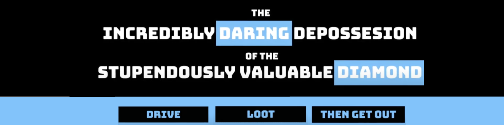
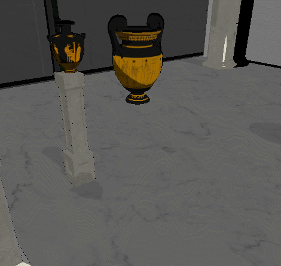
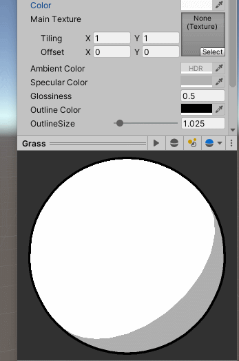
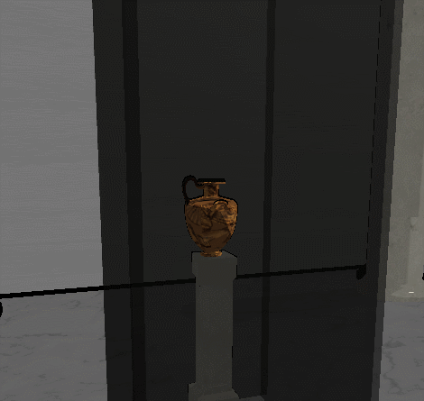
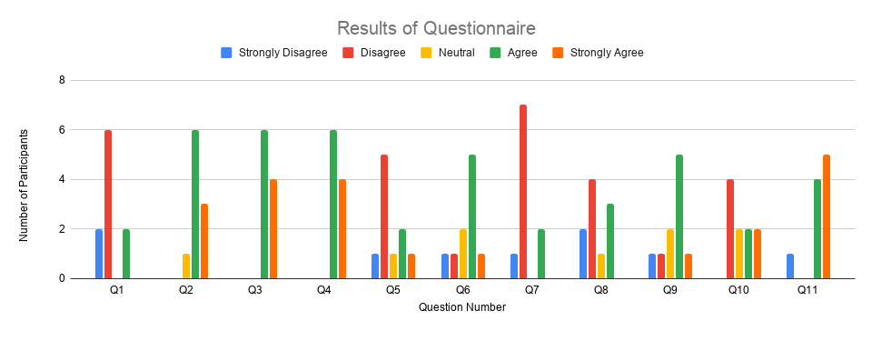

**The University of Melbourne**
# COMP30019 – Graphics and Interaction

# Project-2 Report 

## General info
This readme and report is in relation to Project 2 for COMP30019. Our team was tasked with creating a three-dimensional game using Unity, which included modelling objects and entities, considering human interaction, and implementing shaders and particle effects to achieve a consistent aesthetic. 

The game was evaluated using cooperative evaluation and questionnaires completed by a number of playtesters. Improvements to user interaction were made based on the collected information. 


### Instructions

The project can be downloaded and imported into Unity. Building the game will produce an executable that can be run, launching the game. In game, you start with enough money to buy everything, for convenience.

## Table of contents
* [Team Members](#team-members)
* [Technologies](#technologies)
* [Introduction to the Game](#introduction-to-the-game)
* [Controls and UI](#controls-and-UI)
* [Modelling of Objects and Level Design](#modelling-of-object-and-level-design)
* [Graphics pipeline and camera motion](#graphics-pipeline-and-camera-motion) 
* [The Shaders](#the-shaders)  
* [Evaluation](#evaluation)
* [Outcome of Evaluation](#outcome-of-evaluation)
* [Sourced code](#sourced-code)
* [Contributions](#contributions)


## Team Members
|Name| Student Number| GitHub ID
| :---                 |     :---:   |     ---:|
|Sophie Son        |    656483|sson21|
|Chamira Balasuriya    |     777906|crb444|
|Ujjwal Agarwal        |    983837|Ujjwal007|
|Joshua Robinson    |    999565|JoRobs|

## Technologies
Project is created with:
* Unity 2019.4.3f1
* Unity Asset Store 
* Blender 2.90.1
* Autodesk FBX Converter 2013.3 


## Introduction to the Game
Welcome to ‘The Incredibly Daring Depossession of the Stupendously Valuable Diamond’! Your objective is simple, explore the museum and obtain as many valuable items as possible. Some things are worth more than others, and the most valuable items are hidden behind security cases, so find and destroy the security systems first. However, you must do all this within the given amount of time. Once escaped, you can use the cash you obtained to purchase better cars for faster runs. Good luck!  

## Controls and UI

When you start the game, you will be loaded into the main menu. From here you can jump into the game, purchase or change your vehicle, adjust settings, or exit out. (You start with enough money to purchase everything for convenience).

Pressing “Play” lets you select a level, the only level with gameplay fully implemented is the “Museum” level, “FreePlay” lets you drive around and test your car. In the “Museum” level your task is to break into a museum full of rare artifacts, steal as many as you can, then get out before the cops arrive. You’ll have 2 minutes to grab as much loot as you can and get out, if you do so successfully you fence the loot and keep the profit. 

You control your vehicle with the “WASD” keys on the keyboard, pressing “Spacebar” uses the powerful handbrake, bringing the car to a stop, and holding “Left Shift” allows vehicles with a high “Drifting” stat to let their wheels slip, allowing them to drift around corners. Additionally you can press “N” to toggle highlighting objects of value, so you know what is worth getting. 

The in game UI consists of a timer that counts down from 2 minutes, indicating the time you have left, a score which shows you how much money this run will make you if you escape, and at the bottom of the screen is a list of the controls. Pressing “Escape” pauses the game and allows you to return to the main menu and restart the level.

## Modelling of Objects and Level Design 

### Level Design

Similar to any form of level design for a game, the first logical step was research. As the goal was to recreate a museum, research was in the form of exploring designs of real museums around the world – to essentially get inspiration. Examples of level design on Unity were explored to gauge a sense of direction in adding verticality and obstacles to the level. The first draft of the museum was a basic floor plan which included no verticality and a few objects. This served as a foundation to determine what worked well and what didn’t work well, which led to the group using Draw.io to formally design a level which can easily be recreated in Unity. 

For the construction of stairs and other complex foundations, a level design tool known as ProBuilder was used. This, in combination with ProGrids, gave the ability to create and modify complex shapes with ease, whilst also allowing easy alignment with neighbouring shapes. Some of the objects created with ProBuilder were: stairs, ramps, walls, glass panels for the stairs and banisters. 

### Modelling of Objects

The Unity asset store served as the main location for the valuable objects that were going to be placed in the museum. As there were multiple objects from different time periods, this allowed the creation of two main periodic rooms: Egypt and Greek/Roman. Additionally, columns which served as the stands for these objects were also downloaded from the asset store. As the main objective of the game was to procure these objects, without breaking them – these objects needed to be broken somehow, which was completed with the use of Blender. 

Blender’s inbuilt Cell Fracture feature allows for objects to be fractured. [FBXExporter]( https://docs.unity3d.com/Packages/com.unity.formats.fbx@2.0/manual/index.html) allowed assets to be exported with their textures, while [Autodesk FBX converter](https://www.autodesk.com/developer-network/platform-technologies/fbx-converter-archives) converted into the appropriate format for Blender.  

In Blender, when the asset was imported, Cell Fracture was used to fracture and create multiple pieces. This was set to 10 (as any higher number affected performance) and the size of the pieces was set to random. The fractured asset was then saved back to a .fbx format to be imported into Unity. 

In Unity, the fractured asset is imported and resized to match the original. Rigid bodies and mesh colliders (with gravity and the convex settings) were added to each individual piece. This ensures that when the valuable item hits the ground, the individual pieces have their own physics. A script controls the actual break, where upon hitting the floor, the original asset is destroyed and the broken version of the asset is initialised in the exact same position. The broken asset is also destroyed after a period of time to maximise performance. 



### Particle effects

To communicate to the player when an object has successfully been “looted” a particle effect was used. The goal was to make the effect satisfying to see, to do this explosive movement followed by slow relaxation was used. The explosive movement is the initial release of particles all at once at the start with speed, the relaxation is the particles being slowed down by gravity and shrinking as time goes on. 


## Graphics pipeline and camera motion 

### Graphics pipeline

The primary effect used in this project is a “toon effect” that uses a smoothstep function to draw sharp boundaries between illuminated and obscured parts of surfaces. The majority of this effect is accomplished in the fragment shader using the vertex normal values from the vertex shader. This improves over a CPU based approach as most of the calculations can be completed in parallel using very little information from the scene. 

In order to receive shadows the shader uses the \#pragma multi_compile_fwdbase directive and macros from the AutoLight.cginc include. Shadow data is passed from the scene to the output vertex and then into the fragment shader, where it’s used to adjust the color of the pixel.

The shader also uses the built-in “Legacy Shaders/VertexLit/SHADOWCASTER” pass to then cast shadows on other objects.

Another aspect of the toon shader is the outlines around objects, simulating black, inky lines of comic book illustrations. This is achieved by having a second pass that uses the vertex shader to scale the vertices of an object to be slightly larger than the original. It’s also set to perform front culling, but not back culling, so you see the “inside” of the scaled object around the original object. The colour of the scaled object is set to be black, producing an outline effect.

A secondary effect was also used, a “Hologram” effect that produces a glowing, pulsing rim around objects. This was done using a pass that first masks the “inner” parts of an object, normally obscured by the outside surface, then a pass that uses a surface shader to change the colour of the surface around the “rim” of the object, based on the viewing angle.

### Camera

In game, the camera follows behind the vehicle, maintaining a constant distance when it can. To avoid camera obstructions, the camera will move closer to the vehicle when there is an obstacle between it’s view and the vehicle. 

This effect is accomplished using raycasting. The camera has a desired destination that is a fixed Vector3 from the vehicle, every frame the camera moves toward that destination and adjusts its direction to look at the target vehicle. A ray is cast from the vehicle to each of the 4 corners of the camera’s viewport, if there is a point of intersection whose distance is less than the desired distance, a new destination is set that is closer to the vehicle such that the camera’s view of the vehicle is not obstructed.

For cases where the distance between the camera and the vehicle becomes too small, the camera is moved over the car to avoid intersecting with the car’s model.


## The Shaders  

### Toon Effect

#### Toon Shading

The Toon shader that was implemented in this project is based on the Blinn-Phong shading model, which consists of Directional Lighting, Ambient Light, and Specular reflection. To achieve the toon-like effect, a smoothstep function is used twice: once for Directional Light and once for Specular Intensity. This divides the light into two bands with relatively sharp, toon-like edges.

```HLSL
float lightIntensity = smoothstep(0, 0.02, NdotL * shadow);    
```

```HLSL
float specularIntensitySmooth = smoothstep(0.005, 0.02, specularIntensity);
```
 


#### Outline Shading

Once the toon effect was done, we created an outline using a second pass, the first produces the toon effect and culls the back faces, and the second produces a slightly larger black object and culls the front faces. In the second pass, the front faces are culled in order to leave the toon effect in front and produce the outline around it.

#### Parameters

The shader included a few properties that allowed use to create custom materials for different objects. The colors of ambient and specular aspects can be adjusted, along with the glossiness, outline colour and outline size



```HLSL
SubShader
{
    Pass
    {
        cull back
    }

    Pass
    {
        cull front
    }
}
```


The first pass constructs the toon shader and second pass renders an outline. During the second pass, only a plain outline colour is returned in the vertex function, with each vertex scaled to be slightly larger than the toon shader in a vertex shader. 

```HLSL
o.vertex=UnityObjectToClipPos(v.vertex*_OutlineSize);
```

The vertex position is multiplied by _OutlineSize to make the outline bigger than the toon shader.
 
### Hologram Shader

The Hologram Shader was made using a pass and a surface shader. The first pass masks inner vertices, and the surface shader calculates the objects rim and applies a colour to it. 

The shader uses the tag {"Queue" = "Transparent"}, which renders the default object transparent and then applies the shader, the script will only draw the emission of the rim light on top of the transparent object. The rim is calculated by taking the normalised view direction as input and calculating it’s dot product with the surface normal.

```HLSL
float rim = 1.0 - saturate(dot(normalize(IN.viewDir), o.Normal));
```

The emission of a certain part of the object is calculated using this rim, along with a provided colour property and a “power” property

```HLSL
o.Emission = _RimColour.rgb * pow(rim, _RimPower) * 10;
```

Finally, the alpha value of the rim is calculated based on the cosine of the current time passed to produce a pulsing effect.

```HLSL
float time = cos(_Time.y)+1;
rim = pow(rim, _RimPower*time);
o.Alpha = rim;
```



Performing these calculations, along with the default MVP matrix transformations on each vertex using a CPU based approach would be slow, and is sped up by using specialised hardware in the GPU that can perform many of these calculations in parallel.


## Evaluation 


### Demographics 

The chosen demographic of the 10 participants for the evaluation were individuals who were aged between 21 and 28 years of age, who had a passion and/or a history of playing video games.

### Method

For evaluation, one observational and one query technique was selected. The observational method selected was Cooperative evaluation. This allowed for a more conversational approach, where the user was able to give direct thoughts on their experience, whilst completing a list of predefined tasks. The querying technique used was a questionnaire, where testers played for a while, then filled out a set of questions based on their experience. The overall approach involved performing cooperative evaluations with 5 people, who then filled out the questionnaire, and having another 5 people play the game and fill the questionnaire in their own time. 

### Cooperative evaluation

To ensure the evaluation provided valuable feedback, the cooperative evaluation focused on core components of the game. These components were: Driving mechanics, Looting mechanics, level design, gameplay, gameplay menu/UI and aesthetics. 

Each section was then divided into more detailed aspects, which then had tasks created to test them. 

#### Driving Mechanics 

Driving, being a crucial part of gameplay, was broken down into three main areas: *driving experience, general maneuverability* and *obstacle navigation*. *Driving experience* focused on the user quickly determining whether driving was smooth or clunky, without the presence of any obstacles. In comparison, *general maneuverability* focused on the car’s ability to handle making turns, accelerating and reversing - all with precision. Lastly, *obstacle navigation* encompassed the previous two areas to test the cars ability to maneuver ramps and scaffolding in the map. 


#### Looting Mechanics 

The main objective of the game involved the idea of looting, so to test its validity it was separated into two main areas: *Intuitiveness* and *sensitivity*. *Intuitiveness* focused on whether the process of looting was intuitive to the player, without the aid of directions. On the other hand, *sensitivity* focused on the difficulty aspect of looting - whether an object can be looted without breaking it. 


#### Level Design 

The key focus area for level design is how it affected the objective. This was mainly determined by obtaining feedback on the *placement of loot*. 


#### Gameplay 

This was deemed crucial to determine the difficulty of the game. The two main areas focused on: a *successful outcome* and *successfully obtaining valuable items*. The area of *successful outcome* focused purely on the difficulty in completing the game, with the highest possible score that a user can achieve. In comparison, the *valuable items* section determined the difficulty to obtain the valuable loot in the given time. 


#### Gameplay Menu and UI 

The menu and UI were deemed a crucial aspect of user experience and thus, the two main focus areas were the: *In-game HUD* and the *upgrades menu*. It is important to gauge whether the in-game HUD not only provides valuable information, but is located in a position that is easy for the player to constantly refer to. Additionally, the upgrades menu should be not only easy to navigate but also have upgradable parameters which are clear to the player. 

#### Aesthetics 

This aspect focuses on the general art style of the game and whether it complements the narrative that the game is trying to portray. 


The process involved the participants completing a list of tasks related to each of aforementioned areas, whilst the developers took notes. The participants were encouraged to continuously give any feedback. 

A detailed list of tasks can be found [here](/Documents/EvalTests.md). 

The method of recording these evaluations was by taking notes real time during the process. A list of those notes can be found [here](/Documents/EvalNotes.md). 


### Questionnaire

The following are areas identified by the group that focus on the core aspects of the game, similar to the cooperative evaluation, as well as the emotions the user feels while playing. These areas are the ones focused on by the questionnaire:
Ease of control
Level memorability 
Satisfaction of completing objective
Level of challenge 
Gameplay and Level Design
Menu and UI 
Art style and visuals 

It was determined that the questions would all adhere to the Likert scale ranging from strongly disagree to strongly agree. This would also aid in quantitative analysis. 

The questions from the questionnaire are as follows:

The car had no difficulty maneuvering through obstacles
It was easy to remember the level and easily navigate back to already explored area
Completing the objective was satisfying
It was a challenging task to obtain a high score
There was ample time to complete the level
I can obtain a higher score next time I play the game
There was no difficulty in looting objects without breaking them
There was no difficulty in navigating in between loot
Finding the security systems for the valuable items was difficult
I knew how all the upgradable parameters would affect the car
The upgrade menu was easy to navigate and intuitive

A link to the questionnaire can be found [here](https://docs.google.com/forms/d/e/1FAIpQLSd2rF_18_xV5p5oOV5QLIyuL9zhCG5f6SdM0WmkQzDEr1geww/viewform)

And the results are as follows:



## Outcome of Evaluation 

First of all, a number of bugs were found during the evaluation.

#### General Bugs 

Crashes on exit after using return to main menu from pause screen
Drive in menu after using pause menu
Went through the glass entrance and kept getting stuck, even when the glass was cleared 
Camera goes behind a wall in the maintenance room and car is obscured by wall 
Play the game, end up X amount of loot, then restart the game, X amount is not added to new amount - harder to purchase the higher priced car 
After buying the blue car and restarting again, it still says select 

The feedback was analysed by the group and ranked on priority based on the number of responses with common issues. Bugs were patched first, then the highest priority issues were implemented. A list of changes can be found [here](/Documents/EvalChanges.md). 

Generally, we came to a few key realisations. First, the car stats needed tweaking to make the driving feel better. We decided to forgo the upgrades menu that allowed you to change the stats of your car for a more intuitive option of purchasing different vehicles. This allowed us to focus on making vehicle stats that felt good to drive.


More changes to the gameplay involved making the driving a little easier. Some objects such as the shards of shattered glass were difficult to drive over, so their collision with the car was removed. Also, the pillars in some rooms caused the car to become stuck when driven over. Reducing their size so the cars can easily drive over them provided an easy fix to this.

We found that the looting mechanic was in a good spot, but it was sometimes hard to recognise what could be looted, so we added a toggle option that lets you highlight lootable objects.


Another addition was the intro cutscene that briefly explains the objective of the game. This was another issue found during play testing, when not prompted, the objective wasn’t really clear to the testers. So by adding the cutscene it explains what a player must do.

Many playtesters didn’t realise they were running out of time to exit the level as they were playing, so would often fail to complete it. To address this, the timer changes colour to red when below 30 seconds, to indicate the player must look to leave.

## Sourced code 

### Assets from Unity Asset Store 
- [Single Detailed Truck](https://assetstore.unity.com/packages/3d/vehicles/land/single-detailed-truck-895)
- [Simple Health Bar](https://assetstore.unity.com/packages/tools/gui/simple-healthbars-132547)
- [Simple Gems Ultimate Animated Customizable Pack](https://assetstore.unity.com/packages/3d/props/simple-gems-ultimate-animated-customizable-pack-73764)
- [Snack Machines](https://assetstore.unity.com/packages/3d/props/interior/snack-machines-3517)
- [Big Furniture Pack](https://assetstore.unity.com/packages/3d/props/furniture/big-furniture-pack-7717)
- [Industrial Props Kit](https://assetstore.unity.com/packages/3d/props/industrial/industrial-props-kit-84745) 
- [Desert Kits 64 Sample](https://assetstore.unity.com/packages/3d/environments/landscapes/desert-kits-64-sample-86482)
- [Discobolus Statue](https://assetstore.unity.com/packages/3d/props/discobolus-statue-107544)
- [Construction Site Pack](https://assetstore.unity.com/packages/3d/props/industrial/construction-site-pack-3316#content) 
- [Julius Caesar Bust](https://assetstore.unity.com/packages/3d/props/julius-caesar-bust-25088)
- [Medieval Falcata](https://assetstore.unity.com/packages/3d/props/weapons/medieval-falcata-54134)
- [Yughues Free Pillars & Columns](https://assetstore.unity.com/packages/3d/environments/yughues-free-pillars-columns-13103#content)
- [Egyptian Tomb: Cat Statue](https://assetstore.unity.com/packages/3d/environments/historic/egyptian-tomb-cat-statue-119784)
- [Greek Temple: Vases](https://assetstore.unity.com/packages/3d/environments/historic/greek-temple-vases-149134) 
- [Paintings Free](https://assetstore.unity.com/packages/3d/props/interior/paintings-free-44185#content) 
- [Traffic cone & Roadblock](https://assetstore.unity.com/packages/3d/props/traffic-cone-roadblock-3dscan-109209) 
- [Ancient Breakable Pottery](https://assetstore.unity.com/packages/3d/props/interior/ancient-breakable-pottery-12440#content) 
- [Restaurant Interior Full Pack](https://assetstore.unity.com/packages/3d/props/interior/restaurant-interior-full-pack-153273) 
- [Restaurant LittlePack](https://assetstore.unity.com/packages/3d/props/interior/restaurant-littlepack-176673) 
- [Stylize Sand Pillar](https://assetstore.unity.com/packages/3d/props/exterior/stylize-sand-pillar-59604) 
- [Fountain Prop](https://assetstore.unity.com/packages/3d/fountain-prop-75912)
- [Vase Egypt Free](https://assetstore.unity.com/packages/3d/props/vase-egypt-free-149689)
- [Stylized Vehicles Pack - FREE](https://assetstore.unity.com/packages/3d/vehicles/land/stylized-vehicles-pack-free-1503)
- [Modern Table With Chairs](https://assetstore.unity.com/packages/3d/props/interior/modern-table-with-chairs-83834)


## Contributions

### Ujjwal Agarwal

Created the first implementation of the user interface used during evaluations.

### Chamira Balasuriya

Primary task was to design the museum level, which focused on initial planning then level design. This also involved the creation of breakable objects throughout the level and their relevant scripts. 

Contributed towards the game play video by designing and editing. Lastly, aided in designing the tests for cooperative evaluations, designing the questionnaire and finally also performing the cooperative evaluations. 

### Joshua Robinson

Their main task was around gameplay elements and camera implementation. The responsibilities for gameplay were implementing the driving physics, user input, along with the game logic of menus and levels. The responsibilities for camera implementation involved ensuring the camera captured the gameplay effectively and did not hinder the action, preventing objects from obscuring the camera’s view of the player’s vehicle was the main challenge here.

Secondary tasks included UI design and logic and creating the gameplay video.

They also performed several cooperative evaluations to determine improvements that could be made for the game.

### Sophie Son

Primary role was focused around graphics and shader development. This included initial research into non-trivial shaders which fits the narrative of the game. Designed and continuously modified the ToonShader and Holographic shader through parameterisation. 

Also improved the ToonShader with the addition of prominent outlines. Finally, aided in the addition of sound into the game, which involved modifying a number of scripts to implement sound. 


